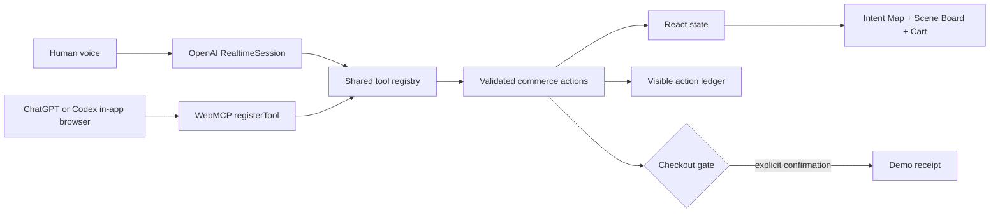

# Her Shopping — WebMCP Hackathon Product Vision

> **Decision update — September 1, 2026:** Her Shopping has evolved from an intent-to-cart assistant into an **adaptive storefront that restructures its own interface around the user's mission**. This document remains the original research and compliance brief. The current implementation specification is [HER_SHOPPING_ADAPTIVE_STOREFRONT_PLAN.md](./HER_SHOPPING_ADAPTIVE_STOREFRONT_PLAN.md).
>
> [https://webmcp.devpost.com/updates/46161-2-days-left-and-what-judges-actually-look-for](https://webmcp.devpost.com/updates/46161-2-days-left-and-what-judges-actually-look-for) add these docs so that we know what to look for

**Working tagline:** Say the moment. Shape the cart.

**Status:** Recommended direction; ready to build  
**Decision:** Build the commerce concept, but make it *intent-to-outcome commerce*, not a generic storefront or chatbot.  
**Last rule verification:** September 1, 2026  
**Submission deadline:** September 3, 2026 at 1:00 PM Pacific Time

> This is a practical product and compliance brief, not legal advice. The official rules and Devpost terms remain the source of truth and can change. Re-check them immediately before submission.

## 1. Executive decision

Build **Her Shopping**, a fictional lifestyle store where a person describes the real-world moment they want to create and a voice agent turns that fuzzy intent into a complete, constrained, editable cart.

Example:

> “I’m hosting a balcony movie night for four. Keep it under $120, avoid single-use plastic, and make the snacks dairy-free.”

The agent does more than search. It creates a visible **Intent Map** of the goal, constraints, tradeoffs, and cart. The person can interrupt by voice or manipulate the same interface directly. Every agent action appears on the page, can be inspected, and can be reversed. Checkout is a simulated order and always pauses for explicit human confirmation.

This direction is stronger than either a pure study app or a normal shopping assistant because it makes the core WebMCP idea unmistakable: the person and the agent share the same live interface and application state, and the website gives the agent precise tools instead of forcing it to guess at buttons.

### Product thesis

**People do not naturally think in SKUs. They think in outcomes, constraints, and tradeoffs. Her Shopping lets a person speak the outcome while an agent assembles and visibly negotiates the cart.**

## 2. Why this concept wins the idea decision

| Direction | WebMCP leverage | Three-minute demo clarity | Novelty | Voice value | Two-day feasibility | Overall |
| --- | ---: | ---: | ---: | ---: | ---: | ---: |
| Pure study planner/tutor | 4/5 | 4/5 | 3/5 | 4/5 | 3/5 | 18/25 |
| Generic voice shopping store | 5/5 | 5/5 | 2/5 | 4/5 | 5/5 | 21/25 |
| **Her Shopping: intent-to-outcome commerce** | **5/5** | **5/5** | **4/5** | **5/5** | **4/5** | **23/25** |

### Why not lead with the study app

A study app can have real impact, but its obvious features—summaries, plans, flashcards, quizzes, and tutoring—can be built as an ordinary AI app. In a short judging window, it is harder to prove that WebMCP is essential rather than decorative.

### Why not build a normal commerce app

Search, recommendations, add-to-cart, and checkout are an excellent WebMCP fit, but a generic version is already familiar. OpenAI’s showcase currently includes a shared grocery cart and several storefront concepts. A standard “find shoes under $100 and add them to cart” demo would score well on feasibility but weakly on creativity.

### Why Her Shopping is distinct

- It shops for a **multi-item outcome**, not a single product.
- The agent must reconcile budget, preferences, exclusions, quantities, and purpose.
- The UI exposes the agent’s reasoning as a visual constraint map instead of a wall of chat.
- The person can adjust a constraint directly and ask the agent to repair the cart.
- Voice is useful because people can describe a messy situation faster than they can fill out filters.
- The WebMCP tool sequence is non-trivial, visible, and easy for judges to verify.

The study idea should remain a future vertical, not part of the MVP. Her Shopping’s action layer could later power a “build my study ritual” scene, but combining tutoring and commerce now would dilute the story.

## 3. Hackathon rules and compliance gates

The full [official rules](https://webmcp.devpost.com/rules), [hackathon overview](https://webmcp.devpost.com/), and incorporated [Devpost Terms of Service](https://info.devpost.com/legal/terms-of-service) were reviewed before choosing the concept.

### Eligibility — confirm before investing further

- Every entrant must be at least the age of majority where they reside.
- The entrant must reside in an eligible country or territory supported by OpenAI API services and not be in an excluded jurisdiction.
- The exclusion list includes the province of Quebec. Do not assume Canadian eligibility without confirming the entrant’s actual province of residence.
- A team or organization must appoint one authorized representative.
- Judges, promotion-entity staff/agents, specified relatives/household members, and conflicts of interest are ineligible.
- Register for the hackathon on Devpost before the deadline.

### Project requirements

- Create a WebMCP-powered web app for humans and agents to use together.
- The project must run consistently on its stated platform and work as shown in the description and video.
- Because this repository begins during the submission period, preserve dated Git history. If any pre-existing code is introduced, document exactly what existed before August 25 and what WebMCP work was added during the hackathon.
- Use third-party SDKs, APIs, data, fonts, and assets only when authorized by their terms and licenses.
- Keep the submission original and solely owned by the entrant/team. Credit all permitted third-party work.

### Required submission package

- A working live URL accessible in ChatGPT’s in-app browser or Chrome 149+ with WebMCP testing enabled.
- A concise English description explaining:
  - why the use case is a strong WebMCP fit;
  - how it improves the user experience;
  - what people and agents can now do together;
  - how WebMCP was implemented.
- A public GitHub, GitLab, or Bitbucket repository with all code, assets, and setup instructions.
- An open-source license file that is detectable and visible at the top of the repository page/About section.
- Real imperative WebMCP registration in the code using `document.modelContext.registerTool(...)`.
- A public YouTube demo with audio, strictly under three minutes. Judges are not required to watch beyond three minutes.
- No unlicensed trademarks, copyrighted music, images, video, or other third-party material in the demo or submission.
- If authentication is used, provide working judge credentials. Prefer a frictionless public demo mode.
- Keep the project available free of charge and without restrictions for judging through the end of the judging period.

### Submission and IP cautions

- Back up the submission and verify every link before the deadline; entrants are responsible for completeness.
- The submission cannot be substantively changed after the deadline unless Devpost specifically permits a limited correction.
- Do not submit confidential or third-party personal information. Treat submitted materials as public.
- Devpost and the sponsor receive licenses to display and promote the submission under their rules/terms, while the entrant retains ownership as described there.
- Do not claim affiliation with OpenAI, Devpost, Shopify, or any sponsor. Use an original product name and original visual identity.
- Re-check the official rules immediately before submission because they may be amended.

### Product-specific safety choices

- Use a fictional catalog and **simulated checkout**. Do not process real payments.
- Collect no real address, card, or sensitive personal data.
- The `place_demo_order` action must show a clear review modal and require explicit user confirmation.
- Show prices, quantities, constraints, shipping assumption, and final total before confirmation.
- Make all cart mutations reversible until the final demo order is confirmed.

## 4. Fit to the judging criteria

The four Stage Two criteria are equally weighted. The product should be designed and demonstrated against all four.

### WebMCP Leverage

**What judges ask:** Is the use thorough, skillful, working, and non-trivial?

Her Shopping’s evidence:

- Ten narrow, structured tools cover discovery, intent, comparison, cart repair, and checkout.
- Tools operate on the same state and UI that the person sees.
- Read tools and write tools are clearly distinguished.
- Inputs use strict JSON Schema; tool results return verification-friendly state.
- A visible action ledger shows the exact tool, summary, outcome, and undo availability.
- The final video shows the browser’s Site tools panel or inspector so WebMCP use cannot be mistaken for ordinary DOM clicking.

### Execution

**What judges ask:** Is this a coherent product rather than a technical proof of concept?

Her Shopping’s evidence:

- A polished single-page experience with a clear start, collaboration loop, cart, confirmation, and receipt.
- Both voice and direct manipulation change the same interface.
- Deterministic seeded data makes the demo reliable.
- A no-login demo mode and one-click reset make judging frictionless.

### Potential Impact

**Audience:** People buying several coordinated items for a small event, project, trip, room, or ritual while balancing cost and constraints.

**Problem:** Product search is optimized for known items. It is tedious when the user knows the outcome but not the exact shopping list, and current assistants often hide why an item was selected or lose constraints during cart changes.

**Impact claim:** Her Shopping compresses a multi-search, multi-filter shopping session into a transparent collaboration without removing human control.

### Creativity & Ambition

Her Shopping differs from an AI search box through its Intent Map, live constraint repair, reversible agent ledger, and outcome-based multi-item scenes. The ambition is in the interaction model, not in unnecessary infrastructure.

## 5. Core experience

### The visual idea

The page should feel like a calm creative studio, not an e-commerce grid with a chat bubble bolted on.

1. **Intent Map** — goal, people, budget, hard constraints, soft preferences, and unresolved choices as editable chips.
2. **Scene Board** — four purpose lanes such as Atmosphere, Comfort, Food, and Utility. Product cards land in a lane with a one-line “why it belongs” explanation.
3. **Cart Meter** — total, remaining budget, constraint coverage, and any conflicts.
4. **Agent Ledger** — a compact timeline of tool calls and visible results, with undo where safe.
5. **Voice Orb** — idle/listening/thinking/speaking/tool states. It should animate subtly and never obscure the shared page.

### Golden user journey

1. The person taps **Start voice** and says the movie-night request.
2. The voice agent extracts goal and constraints with `set_shopping_intent`.
3. The Intent Map animates into view.
4. The agent calls `search_products` and `compare_products` for the relevant purpose lanes.
5. It calls `add_items_to_cart`; products visibly arrive on the Scene Board and the budget meter updates.
6. The agent briefly explains one tradeoff: “I chose rechargeable lights to avoid disposables, but that uses $12 more of the budget.”
7. The person says: “Swap the bulky blanket for something packable and keep the total below $100.”
8. The agent calls `replace_cart_item`; the old card exits, the new card enters, and the map shows the repaired budget constraint.
9. The person asks to check out.
10. The agent calls `preview_checkout`, summarizes the exact order, then asks for confirmation.
11. Only after confirmation does `place_demo_order` create a fictional receipt.

### Example catalog

Use 18–24 original fictional products across four categories. Each product should have price, inventory, tags, purposes, constraints, and a short original description.

Example fields:

```ts
type Product = {
  id: string;
  name: string;
  priceCents: number;
  category: "atmosphere" | "comfort" | "food" | "utility";
  tags: string[];
  satisfies: string[];
  conflicts: string[];
  inventory: number;
  image: string;
};
```

Do not integrate Shopify, a live catalog, or real inventory for the MVP. Those add risk without improving the judging story.

## 6. WebMCP tool contract

Register all tools from the top-level page with the imperative API. OpenAI’s current site-tools implementation does not discover declarative tools or tools registered inside iframes.

| Tool | Type | Purpose | Visible verification |
| --- | --- | --- | --- |
| `get_store_state` | Read | Return current intent, cart, budget, route/view, and catalog metadata | No mutation; ledger shows inspection |
| `set_shopping_intent` | Write | Set goal, party size, budget, hard constraints, and preferences | Intent chips and budget meter update |
| `search_products` | Read | Search by purpose, price ceiling, tags, exclusions, and inventory | Matching product tray appears |
| `compare_products` | Read | Compare 2–4 product IDs against active intent | Compact comparison sheet appears |
| `add_items_to_cart` | Write | Add one or more product IDs with bounded quantities and reasons | Cards enter the Scene Board; total updates |
| `replace_cart_item` | Write | Atomically replace one cart line with another | Swap animation plus before/after ledger entry |
| `remove_cart_item` | Write | Remove a cart line by product ID | Card exits; totals and coverage update |
| `get_cart` | Read | Return line items, totals, remaining budget, and conflicts | No mutation; cart can be verified |
| `preview_checkout` | Read | Validate inventory, constraints, quantities, and totals | Review modal opens with warnings |
| `place_demo_order` | Consequential write | Create a fictional order only after explicit confirmation | Confirmation gate, then demo receipt |

### Tool design rules

- Keep arguments narrow and bounded. Limit free-text fields and array lengths.
- Set `additionalProperties: false` in every input schema.
- Use `annotations: { readOnlyHint: true }` only for genuinely read-only tools.
- Describe every side effect plainly in the tool description.
- Reuse the application’s normal validation and state transitions; do not build a separate hidden agent path.
- Return the changed IDs, new totals, remaining budget, warnings, and a short human-readable summary so the agent can verify the result.
- Never accept payment details, arbitrary URLs, HTML, or executable content.
- Keep all tool registrations in the top-level document and re-register predictably on reload.
- Detect unsupported browsers and preserve the complete human interface as a progressive enhancement fallback.

### Registration shape

```ts
if (typeof document.modelContext?.registerTool === "function") {
  await document.modelContext.registerTool({
    name: "add_items_to_cart",
    description:
      "Add catalog products to the visible demo cart. This changes cart state but does not place an order.",
    inputSchema: {
      type: "object",
      properties: {
        items: {
          type: "array",
          minItems: 1,
          maxItems: 6,
          items: {
            type: "object",
            properties: {
              productId: { type: "string", maxLength: 64 },
              quantity: { type: "integer", minimum: 1, maximum: 8 },
              reason: { type: "string", maxLength: 160 }
            },
            required: ["productId", "quantity"],
            additionalProperties: false
          }
        }
      },
      required: ["items"],
      additionalProperties: false
    },
    execute: (input) => commerceActions.addItems(input)
  });
}
```

The actual implementation should keep the definitions and schemas in a shared registry so WebMCP, the in-page voice agent, tests, and documentation cannot drift apart.

## 7. Voice architecture

Use OpenAI’s realtime speech-to-speech path so the interaction supports low latency, natural turn taking, interruption, and realtime tool use. The current official starting point for a browser voice agent is `RealtimeAgent` plus `RealtimeSession` from `@openai/agents/realtime`, connected over WebRTC using an ephemeral client secret minted by the application server.

The custom voice agent and external ChatGPT/Codex browser agent should expose the **same tool names, schemas, and action handlers**:



This shared registry matters: voice is not a separate magic chatbot, and WebMCP is not decorative. Every agent path uses the same bounded operations and produces the same visible state transitions.

### Voice behavior

- Speak in short turns; let the interface carry detail.
- Ask at most one clarification when a missing value materially affects the cart.
- Treat hard constraints as non-negotiable unless the user explicitly changes them.
- Explain only meaningful tradeoffs.
- Never claim an action succeeded until the returned tool result confirms it.
- Read the final item count and total before requesting checkout confirmation.
- Support interruption while speaking.

### Model configuration

Keep the realtime model configurable with an environment variable. Use a lower-cost realtime model during development and the strongest available realtime model for the recorded demo only after testing its availability and tool reliability. Do not hard-code an unverified account entitlement.

## 8. Technology decision

### Recommended stack

| Layer | Choice | Reason |
| --- | --- | --- |
| App | Next.js App Router + React + TypeScript | Fast single-repo delivery, server route for ephemeral voice credentials, strong deployment path |
| Styling | Tailwind CSS or a small tokenized CSS layer | Fast polish without a component-library look |
| Client state | React reducer/context | Deterministic and sufficient for a single-session demo; avoids database complexity |
| Catalog | Versioned local TypeScript/JSON fixture | Reliable, original, fast, and inspectable |
| Persistence | `localStorage` for cart/intent only | Survives refresh without auth or a database |
| Voice | `@openai/agents/realtime` with WebRTC | Official browser-oriented realtime voice path and tool support |
| WebMCP | Imperative `document.modelContext.registerTool` | Required by current ChatGPT site-tools support; top-level page only |
| Validation | Zod plus JSON Schemas generated or kept in one registry | Prevents tool/UI drift and validates every call |
| Tests | Vitest for actions/schemas; focused browser smoke test | Highest-value reliability for the available time |
| Hosting | Vercel | Natural fit for Next.js and a simple ephemeral-secret route |
| License | MIT | Simple, recognizable open-source license for a demo project |

### Why no database, auth, real payment, or third-party commerce platform

They do not improve the core judging evidence. A deterministic local catalog and simulated checkout make the project more reliable, easier for judges to access, and safer. The app can still demonstrate the complete human-agent journey from intent to confirmed demo order.

### Browser support strategy

- Primary: latest ChatGPT desktop app in-app browser with Site tools enabled.
- Secondary: Chrome 149+ with `chrome://flags/#enable-webmcp-testing` enabled and browser restarted.
- Build with the imperative JavaScript API in the top-level page.
- Include an “Agent-ready” indicator that reports whether `document.modelContext.registerTool` exists.
- The human UI must remain fully usable when WebMCP is unavailable.

## 9. MVP scope and cut lines

### P0 — must ship

- Original Her Shopping visual identity and responsive single-page UI.
- 18–24 seeded fictional products with original/licensed images.
- Intent Map, Scene Board, cart meter, and action ledger.
- The ten WebMCP tools above, backed by the real UI action layer.
- OpenAI realtime voice connected to the same tools.
- Explicit simulated checkout confirmation and receipt.
- Reset demo button.
- Public deployment, public repository, setup instructions, and MIT license.
- Tested golden path in ChatGPT’s in-app browser and Chrome WebMCP mode.
- Under-three-minute public YouTube demo.

### P1 — add only after the golden path is stable

- Undo for cart mutations.
- Animated comparison drawer.
- A second prepared prompt, such as a quiet reading nook or park picnic.
- Tool-call diagnostic drawer for judges/developers.
- Lightweight unit tests for budget/conflict repair.

### Explicitly out of scope

- Real payments, shipping, taxes, accounts, addresses, and order fulfillment.
- Live Shopify or merchant integrations.
- Web search or external recommendation data.
- Multi-agent orchestration.
- Persistent user profiles or long-term memory.
- A study/tutoring mode.
- Mobile app, browser extension, or native app.
- Declarative WebMCP and iframe-registered tools.

## 10. Delivery plan

### Build order

1. Create the product fixture and deterministic action reducer.
2. Build the Intent Map, Scene Board, cart, confirmation modal, and receipt using direct human controls.
3. Put every state transition behind the shared action registry.
4. Register WebMCP tools and verify them in both supported judge environments.
5. Add the realtime voice layer and mirror the shared tool registry.
6. Add the action ledger and visible agent-ready diagnostics.
7. Polish the one golden prompt; do not broaden the catalog until it is flawless.
8. Deploy, test from a clean browser, and record the demo.
9. Finish README, license, architecture note, testing instructions, and Devpost copy.

### Acceptance test for the golden path

- A clean visitor can open the live URL without signing in.
- The app reports WebMCP support and the browser can list all intended tools.
- Voice starts only after the user grants microphone permission.
- The movie-night prompt creates the correct intent chips.
- All proposed products exist, are in stock, and respect dairy-free/no-single-use constraints.
- Cart total remains at or below the requested budget.
- The replacement request atomically swaps the item and returns the updated total.
- The ledger shows every agent mutation and its result.
- Checkout cannot create a demo order without explicit confirmation.
- Reset restores the known initial state.
- Reload does not expose an API key or sensitive data.
- The demo works exactly as the video claims.

## 11. Demo video script — target 2:45

### 0:00–0:15 — problem and promise

“Online stores make you search item by item, even when what you actually know is the moment you want to create. Her Shopping lets a person and an agent build that outcome together.”

Show the empty Intent Map and Scene Board.

### 0:15–1:10 — voice creates the scene

Say the balcony movie-night prompt. Show the voice state, tool ledger, intent chips, product searches, and cards landing in the four lanes. Keep narration minimal so the interaction is audible.

### 1:10–1:45 — collaboration and repair

Say: “Swap the bulky blanket for something packable and keep the total below $100.” Show the replacement, budget repair, and the exact returned total.

Directly remove or adjust one item with the mouse to prove the person and agent share the same state, then ask the agent to re-check the cart.

### 1:45–2:15 — safe checkout

Ask to check out. Show `preview_checkout`, the human confirmation modal, and the fictional receipt only after explicit confirmation.

### 2:15–2:45 — prove WebMCP

Open the Site tools panel or WebMCP inspector. Briefly show the registered tools and the repository’s shared registration code.

Close with: “Her Shopping is not a chatbot attached to a store. It is a store designed as a shared workspace for people and agents.”

Do not use copyrighted music. Let the product audio and voice interaction carry the video.

## 12. Risks and mitigations

| Risk | Mitigation |
| --- | --- |
| Generic-commerce perception | Lead with outcome planning, Intent Map, constraint repair, and visible collaboration—not product search |
| Voice latency or unreliability | Use one rehearsed deterministic prompt, keep schemas narrow, minimize agent speech, and expose manual controls |
| WebMCP availability differences | Test both ChatGPT in-app browser and Chrome 149+ flag; show agent-ready diagnostics |
| Declarative/iframe incompatibility | Use imperative registration in the top-level document only |
| Checkout safety | Demo-only order, no PII/payment, explicit review and confirmation gate |
| Tool hallucination or invalid inputs | Strict schemas, Zod validation, bounded arrays/strings, structured errors, no arbitrary URLs |
| Asset/IP violation | Use original text/identity and original or clearly licensed imagery/fonts; keep attribution records |
| Scope overload | One page, one catalog, one golden scenario, no auth/database/real payment |
| Submission failure | Public clean-browser test, backup links, early draft submission, final rule re-check |

## 13. Pre-submission checklist

- [ ] Entrant/team eligibility and representative confirmed.
- [ ] Devpost registration complete.
- [ ] Official rules re-checked on submission day.
- [ ] All work is new during the submission window, or prior work is clearly documented.
- [ ] Third-party licenses and terms reviewed; attribution included where required.
- [ ] Live public URL works from a clean session.
- [ ] ChatGPT in-app browser discovers and executes the WebMCP tools.
- [ ] Chrome 149+ WebMCP testing path works.
- [ ] Public repository contains all source, assets, `.env.example`, and setup instructions.
- [ ] `LICENSE` is present and visible in the repository/About section.
- [ ] No API secrets, real personal data, or payment data are committed.
- [ ] English Devpost description answers all four required questions.
- [ ] Public YouTube video is under three minutes, has clear audio, and contains no unlicensed material.
- [ ] Testing instructions and any necessary demo credentials are supplied.
- [ ] Project remains free and accessible through the judging period.
- [ ] Every statement in the description/video matches the deployed build.
- [ ] Submission saved early, then opened and checked from a second browser/session.

## 14. Source notes

Rules and judging:

- [The WebMCP Challenge overview](https://webmcp.devpost.com/)
- [OpenAI WebMCP Challenge Official Rules](https://webmcp.devpost.com/rules)
- [Devpost Terms of Service](https://info.devpost.com/legal/terms-of-service)

WebMCP implementation:

- [OpenAI Site tools / WebMCP documentation](https://learn.chatgpt.com/docs/webmcp)
- [WebMCP draft specification](https://webmachinelearning.github.io/webmcp/)
- [Chrome WebMCP developer guide](https://developer.chrome.com/docs/ai/webmcp)
- [OpenAI showcase](https://developers.openai.com/showcase)

Voice implementation:

- [OpenAI voice agents guide](https://developers.openai.com/api/docs/guides/voice-agents)
- [OpenAI Realtime API with WebRTC](https://developers.openai.com/api/docs/guides/realtime-webrtc)

## Final recommendation

Proceed with **Her Shopping**. It preserves the strongest part of the commerce idea—an unmistakable end-to-end WebMCP workflow—while avoiding the cliché of a voice-controlled product grid. The build should feel like a shared visual planning surface that happens to end in a cart. Ship one beautiful, deterministic, safe scenario rather than a broad store.
