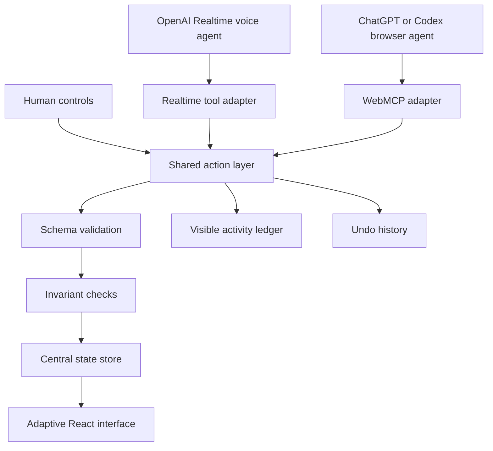

# Her Shopping — Adaptive Storefront Implementation Plan

**Working tagline:** A storefront that redraws itself around your mission.  
**Product category:** Human-agent adaptive interface / agentic commerce  
**Primary technology:** WebMCP plus OpenAI Realtime voice  
**Status:** Approved direction; implementation-ready  
**Target:** A reliable, public, under-three-minute hackathon demonstration

## 1. Executive decision

Build **Her Shopping**, a fictional commerce page whose layout can be reorganized by a human or an agent around the person's current goal.

The user does not ask an assistant to click through a conventional store. They describe what they are trying to accomplish:

> “I am going camping in Iceland for five days. Keep the total below $700, prioritize warmth and Friday delivery, and organize the store around what I still need.”

Her Shopping interprets that intent and visibly transforms the page:

- irrelevant navigation and products are deemphasized or hidden;
- products are regrouped into Essential, Useful, and Optional;
- the budget and delivery constraints become persistent controls;
- relevant alternatives are placed next to each other;
- a comparison surface appears only when it is needed;
- missing requirements and tradeoffs are made visible;
- cart and checkout remain explicit, ordinary, human-controlled actions.

The user can then continue by voice or direct manipulation:

> “Put the cheaper alternatives beside these.”  
> “Hide optional items.”  
> “Make this jacket the reference item.”  
> “Undo the last layout change.”  
> “Add the first two essentials to my cart.”

### Product thesis

**Most websites are organized around the seller's information architecture. Her Shopping temporarily reorganizes the interface around the user's intent, while keeping every change visible, bounded, and reversible.**

### Hackathon thesis

WebMCP is not used as a remote-control layer for simulated clicks. The site deliberately exposes semantic capabilities—inspect, group, focus, compare, move, hide, restore, and transact—that an agent can invoke against the same state the human sees.

## 2. What is being built

Her Shopping is one polished adaptive storefront with three forms:

1. **Browse View** — the conventional human-designed store.
2. **Mission View** — the same store restructured around a declared outcome and constraints.
3. **Comparison View** — a temporary decision interface centered on 2–4 selected products.

It is not a general website builder. It is not an agent that edits arbitrary DOM or CSS. It is a controlled page-composition system built from known components and a validated layout model.

### The central interaction

```text
Human intent
    ↓
Agent inspects the shared page state through WebMCP
    ↓
Agent invokes bounded semantic layout and commerce tools
    ↓
The existing React components visibly reorganize
    ↓
Human accepts, adjusts, selects, or undoes changes
    ↓
Agent continues from the same live state
```

### Why this is not a generic shopping assistant

| Generic shopping agent | Her Shopping |
| --- | --- |
| Operates the store's existing layout | Reconfigures the store into a task-specific interface |
| Primarily search and add-to-cart | Inspect, restructure, compare, explain, and transact |
| Conversation is the main output | The transformed page is the main output |
| Agent state may be hidden in chat | Intent, constraints, selections, and actions are visible |
| User corrects the agent through more prompts | User can also manipulate the same interface directly |
| Often relies on clicking or DOM interpretation | Uses explicit, typed WebMCP capabilities |

### Why this is not another vibe-coding tool

The agent is not generating a new site or editing arbitrary source code. It composes an already-designed product interface using approved components and state transitions. The innovation is adaptive interaction, not code generation.

## 3. Product principles

Every implementation decision should follow these principles:

1. **The page is the artifact.** Chat and speech guide the experience, but the visible page carries the result.
2. **Semantic transformations, not arbitrary code.** The agent changes structured layout state using enumerated operations.
3. **One shared source of truth.** Mouse, keyboard, voice, and external WebMCP agents use the same action handlers and React state.
4. **Human control remains obvious.** Selection, pinning, cart mutation, undo, reset, and checkout controls remain accessible.
5. **Transformation must be legible.** The user should understand what moved, what disappeared, and why.
6. **Every mutation is reversible.** Layout changes and cart mutations create undoable history entries until final demo checkout.
7. **Consequential actions require confirmation.** Reorganizing a page may be automatic; placing even a fictional order may not be.
8. **Progressive enhancement.** The store remains fully usable without WebMCP or microphone access.
9. **A small deterministic demo beats broad automation.** One flawless scenario is the priority.

## 4. User experience specification

### 4.1 Initial Browse View

The initial page should resemble a refined fictional outdoor/lifestyle store, but remain compact enough that the transformation is obvious.

Visible regions:

- **Header:** Her Shopping wordmark, categories, search, cart, and agent-ready indicator.
- **Mission Bar:** a prominent input reading “What are you trying to accomplish?” with voice control.
- **Featured Section:** 3–4 highlighted products.
- **Catalog Canvas:** 18 seeded products in a familiar category grid.
- **Filter Rail:** category, price, attributes, and delivery.
- **Agent Ledger:** collapsed by default but available from a small activity control.
- **Persistent Reset:** restores the original Browse View at any time.

Nothing should look “AI generated.” It should begin as a deliberately designed human interface.

### 4.2 Mission capture

The person speaks or types a mission. The agent extracts only the fields needed to change the interface:

```ts
type Mission = {
  title: string;
  context: string;
  budgetCents?: number;
  partySize?: number;
  hardConstraints: string[];
  preferences: string[];
  deadline?: string;
};
```

The parsed mission appears as editable chips before or during the transformation. Hard constraints look visually different from preferences.

For the Iceland example:

- Mission: five-day Iceland camping trip
- Budget: $700 maximum
- Hard constraint: arrives by Friday
- Priority: warmth
- Preference: lightweight

The user can edit or delete a chip directly. That direct manipulation changes the same state used by the agent.

### 4.3 The transformation moment

When Mission View is applied, animate existing components into new positions rather than replacing the entire DOM in one cut.

The page should visibly perform these operations:

1. The generic promotional area collapses.
2. The Mission Summary and Budget Meter become persistent.
3. Products regroup into **Essential**, **Useful**, and **Optional** lanes.
4. Items that violate hard constraints leave the primary canvas.
5. A “Missing from your plan” callout appears when a purpose has no selected candidate.
6. Delivery and warmth attributes move from secondary metadata to prominent decision information.
7. The filter rail becomes a mission-control rail containing only relevant controls.

The transformation should take roughly 700–1200 ms: long enough to read as a change, short enough to remain productive.

### 4.4 Contextual reference: “this”

The user must be able to select:

- a product card;
- a product group;
- the budget panel;
- the comparison panel;
- a mission constraint.

Selection produces a visible outline and updates `selectedEntity` in shared state. The agent can then interpret commands such as:

> “Make this the reference item.”  
> “Show cheaper alternatives beside this.”  
> “Move this group above optional items.”

If nothing is selected, the agent must not guess what “this” means. It should ask one brief clarification.

### 4.5 Comparison View

Comparison is a temporary page configuration, not a modal full of text.

- It supports 2–4 product IDs.
- It uses mission-relevant comparison attributes first.
- It preserves the Mission Summary and Budget Meter.
- The user can pin one reference item.
- The rest of the catalog becomes secondary but remains reachable.
- “Return to mission” restores the previous layout snapshot.

### 4.6 Cart and checkout

The adaptive interface can recommend and organize, but it must not conceal the transaction.

- Adding to cart is visible and undoable.
- The cart always shows quantity, price, subtotal, and budget effect.
- The agent can prepare a cart but cannot confirm checkout.
- `preview_checkout` opens a review surface.
- `place_demo_order` requires a fresh explicit user confirmation.
- Checkout is simulated; no payment, address, or personal information is collected.

### 4.7 Undo and reset

Two recovery mechanisms are mandatory:

- **Undo last action:** reverses the most recent reversible layout or cart mutation.
- **Reset experience:** returns mission, selection, layout, and cart to the seeded initial state.

The reset control must remain available even if the agent hides or moves other regions.

## 5. Information and layout model

The key to reliability is separating product data, user intent, layout, selection, and commerce state.

```ts
type HerShoppingState = {
  catalog: Product[];
  mission: Mission | null;
  layout: LayoutState;
  selection: SelectedEntity | null;
  cart: CartState;
  activity: ActivityEntry[];
  history: ReversibleSnapshot[];
  capabilities: CapabilityState;
};

type LayoutState = {
  mode: "browse" | "mission" | "compare";
  sectionOrder: SectionId[];
  hiddenSections: SectionId[];
  density: "comfortable" | "compact";
  productGrouping: "category" | "priority" | "purpose";
  productSort: "featured" | "price-low" | "mission-fit" | "delivery";
  focusedProductIds: string[];
  comparisonProductIds: string[];
  referenceProductId?: string;
  persistentPanels: PanelId[];
};

type SelectedEntity =
  | { kind: "product"; id: string }
  | { kind: "section"; id: SectionId }
  | { kind: "constraint"; id: string }
  | { kind: "panel"; id: PanelId };
```

### Product data

Use 18–24 fictional products with fields that support deterministic reasoning:

```ts
type Product = {
  id: string;
  name: string;
  description: string;
  category: "shelter" | "warmth" | "cooking" | "lighting" | "utility";
  purposeTags: string[];
  priceCents: number;
  weightGrams: number;
  warmthRating?: number;
  deliveryDays: number;
  inventory: number;
  badges: string[];
  image: string;
};
```

Use original product names, descriptions, visual identity, and either original illustrations or assets with clearly recorded licenses.

### Layout invariants

Every layout action must preserve these rules:

- The mission bar, cart access, activity access, and reset control can never all be hidden.
- A section ID may appear at most once in `sectionOrder`.
- A hidden section remains recoverable from a “Hidden” control.
- Comparison contains 2–4 valid, in-stock catalog products.
- Layout mutations never alter catalog or cart data.
- Cart mutations never silently alter layout intent.
- A hard constraint violation must be returned as a warning.
- The interface must remain keyboard navigable after every transformation.

## 6. Action architecture

All user and agent mutations go through one validated action layer.



### Shared action result

Every action should return structured verification data:

```ts
type ActionResult<T> = {
  ok: boolean;
  actionId: string;
  summary: string;
  data?: T;
  changedEntityIds: string[];
  warnings: string[];
  undoToken?: string;
  stateVersion: number;
};
```

The agent must use the returned result instead of assuming that a requested change succeeded.

### Transaction behavior

- Validate the entire request before mutating state.
- Apply compound mutations atomically.
- Increment `stateVersion` after each successful write.
- Append one concise activity entry.
- Store a bounded pre-action snapshot for undo.
- Reject stale operations when an optional `expectedStateVersion` does not match.
- Keep at most 20 reversible snapshots in memory/local storage.

## 7. WebMCP tool contract

Register tools through the imperative API in the top-level page. The preview and adaptive canvas must not be placed behind an iframe that owns the registrations.

### P0 tools

| Tool | Effect | Purpose | Confirmation |
| --- | --- | --- | --- |
| `get_page_context` | Read | Return mission, selection, layout, visible groups, cart summary, and state version | None |
| `set_mission` | Write | Set the outcome, budget, hard constraints, preferences, and deadline | None; visible chips update |
| `apply_mission_view` | Write | Change to Mission View and organize products by fit/priority | None; reversible |
| `organize_products` | Write | Group and sort products using bounded enum values | None; reversible |
| `set_section_visibility` | Write | Show or hide approved section IDs | None; reversible |
| `create_comparison` | Write | Enter Comparison View for 2–4 valid products | None; reversible |
| `set_reference_product` | Write | Pin one product as the reference for comparison or alternatives | None; reversible |
| `move_section` | Write | Move an approved section before or after another approved section | None; reversible |
| `get_cart` | Read | Return cart lines, total, budget remainder, and warnings | None |
| `add_to_cart` | Write | Add bounded quantities of valid product IDs | None; visible and reversible |
| `undo_last_action` | Write | Restore the most recent reversible snapshot | None |
| `reset_experience` | Write | Restore initial mission, layout, selection, and cart | Ask for confirmation in agent behavior |
| `preview_checkout` | Read-like UI effect | Validate the cart and open the visible review surface | None |
| `place_demo_order` | Consequential write | Create a fictional receipt from the reviewed cart | Explicit fresh confirmation required |

### Tool behavior details

#### `get_page_context`

Return only concise, decision-relevant state:

```ts
{
  stateVersion: 8,
  mode: "mission",
  mission: { /* normalized mission */ },
  selectedEntity: { kind: "product", id: "thermal-shell-02" },
  visibleSections: ["mission-summary", "essential", "useful", "optional"],
  hiddenSections: ["featured", "editorial"],
  visibleProductIds: ["..."],
  cart: { itemCount: 2, totalCents: 43800, budgetRemainingCents: 26200 },
  warnings: []
}
```

This is how the agent understands “this,” verifies the current layout, and avoids relying on brittle visual guessing.

#### `organize_products`

Use narrow enums rather than arbitrary layout instructions:

```ts
{
  groupBy: "priority" | "purpose" | "category",
  sortBy: "mission-fit" | "price-low" | "delivery" | "featured",
  density?: "comfortable" | "compact",
  explain?: boolean,
  expectedStateVersion?: number
}
```

#### `set_section_visibility`

Only known section IDs may be supplied. Do not accept CSS selectors, HTML, or free-form component names.

```ts
{
  sectionIds: ["featured", "optional"],
  visible: false,
  reason?: "irrelevant" | "focus" | "user-request",
  expectedStateVersion?: number
}
```

#### `move_section`

```ts
{
  sectionId: "essential",
  relation: "before" | "after",
  anchorSectionId: "useful",
  expectedStateVersion?: number
}
```

#### `create_comparison`

```ts
{
  productIds: ["thermal-shell-02", "thermal-shell-05"],
  referenceProductId?: "thermal-shell-02",
  prioritizeAttributes?: ["warmth", "delivery", "weight", "price"]
}
```

### Registration pattern

Maintain one capability registry and thin adapters for WebMCP and Realtime:

```ts
export const capabilities = {
  organize_products: {
    description: "Regroup and sort the visible catalog using approved layout modes.",
    schema: organizeProductsSchema,
    execute: actions.organizeProducts,
    safety: "reversible-layout"
  },
  // ...
};
```

The WebMCP adapter should:

1. detect `document.modelContext?.registerTool`;
2. register each supported capability once at the top level;
3. convert the shared schema to valid JSON Schema;
4. validate again inside `execute`;
5. call the shared action;
6. return a concise `ActionResult`;
7. surface registration status in the UI;
8. unregister or refresh tools predictably during development hot reload.

### WebMCP rules

- Use `additionalProperties: false` for every object schema.
- Bound all strings, arrays, quantities, and product counts.
- Mark genuinely read-only tools with the appropriate annotation.
- State side effects in the tool description.
- Do not accept raw JavaScript, HTML, CSS, URLs, selectors, or filesystem paths.
- Never let a tool bypass normal store validation.
- Return enough state to verify the visual result.
- Preserve the normal human interface as a fallback.

## 8. Voice architecture

Use an OpenAI Realtime voice agent in the browser over WebRTC. The browser requests a short-lived client credential from a server route; the long-lived OpenAI API key never reaches the client.

### Voice flow

```text
Microphone permission
    ↓
RealtimeSession connects with ephemeral client secret
    ↓
Voice agent receives speech and current instructions
    ↓
Realtime tool adapter calls the same capability registry as WebMCP
    ↓
Shared action mutates the adaptive store
    ↓
Page animates and the voice agent briefly summarizes the verified result
```

### Voice agent behavior

- Keep spoken responses to one or two sentences.
- Let the transformed UI carry lists and detailed comparisons.
- Call `get_page_context` before interpreting “this,” “these,” or “the section above.”
- Ask one clarification only when ambiguity would change the result materially.
- Treat hard constraints as binding until the user edits them.
- Never announce success before the tool result returns `ok: true`.
- Explain a tradeoff only when a hard constraint cannot be satisfied or two priorities conflict.
- Accept interruption while speaking.
- Read the item count and total before checkout confirmation.

### Dual-agent story

The embedded voice agent is the polished consumer experience. WebMCP makes the same site capabilities available to ChatGPT or Codex in the in-app browser. Both paths are important:

- **Realtime voice** proves the natural interaction.
- **WebMCP discovery and invocation** proves the page is genuinely agent-ready.
- **Shared capability registry** proves these are not two disconnected demos.

## 9. Visual and interaction design

### Visual direction

Aim for an editorial expedition-planning desk rather than a conventional marketplace:

- warm off-white canvas;
- deep ink typography;
- one high-energy accent color for agent transformations;
- topographic-line motif used sparingly;
- generous card spacing in Browse View;
- denser decision layout in Mission and Comparison views;
- product imagery with consistent original art direction;
- clear motion paths when sections change position.

### Transformation states

Use a small state indicator near the voice control:

- Ready
- Listening
- Understanding mission
- Inspecting page
- Restructuring
- Comparing
- Awaiting confirmation
- Complete

Avoid showing raw chain-of-thought. The Activity Ledger should display only observable actions and outcomes:

```text
Organized products by mission priority
Moved Essentials above Useful
Hidden Featured and Editorial sections
Compared 3 jackets on warmth, delivery, weight, and price
Added 2 items — cart total $438
```

### Direct human controls

The user should be able to:

- select a card or section;
- pin a product;
- hide/show a section;
- reorder sections with accessible move controls;
- edit mission chips;
- add/remove cart items;
- undo;
- reset;
- open the action ledger.

This is necessary evidence that the person and agent share the same interface rather than operating parallel copies of state.

## 10. Technical architecture

### Recommended stack

| Layer | Choice | Reason |
| --- | --- | --- |
| Framework | Next.js App Router, React, TypeScript | One deployable app plus a secure server route for realtime credentials |
| Styling | Tailwind CSS plus design tokens | Fast responsive implementation and consistent transformation states |
| State | Zustand with explicit action methods and persistence middleware | Easy access from React, WebMCP handlers, and voice tool handlers without duplicated state |
| Validation | Zod with JSON Schema export | One schema source for runtime validation and agent definitions |
| Motion | Motion for React or FLIP-style layout animation | Makes page restructuring visually understandable |
| Catalog | Local TypeScript fixture | Deterministic and safe for judging |
| Persistence | Local storage for mission, layout, and cart | No authentication or database required |
| Voice | `@openai/agents` realtime APIs over WebRTC | Low-latency browser speech and tool integration |
| WebMCP | Imperative top-level registration | Current supported discovery path |
| Tests | Vitest plus targeted Playwright/browser smoke tests | Covers deterministic actions and golden user journey |
| Deployment | Vercel or equivalent HTTPS host | Microphone and realtime browser flows require a secure origin |

### Proposed source structure

```text
app/
  page.tsx
  layout.tsx
  api/realtime-token/route.ts
components/
  storefront/
    adaptive-canvas.tsx
    browse-view.tsx
    mission-view.tsx
    comparison-view.tsx
    product-card.tsx
    section-frame.tsx
  mission/
    mission-bar.tsx
    mission-summary.tsx
    budget-meter.tsx
  agent/
    voice-control.tsx
    agent-status.tsx
    activity-ledger.tsx
    webmcp-status.tsx
  cart/
    cart-drawer.tsx
    checkout-review.tsx
    demo-receipt.tsx
lib/
  catalog/products.ts
  state/her-shopping-store.ts
  state/types.ts
  state/invariants.ts
  actions/layout-actions.ts
  actions/commerce-actions.ts
  actions/mission-actions.ts
  capabilities/registry.ts
  capabilities/schemas.ts
  webmcp/register-tools.ts
  voice/create-session.ts
  voice/realtime-tools.ts
  safety/confirmation.ts
  telemetry/activity.ts
tests/
  actions/
  capabilities/
  golden-path.spec.ts
docs/
  HACKATHON_VISION.md
  HER_SHOPPING_ADAPTIVE_STOREFRONT_PLAN.md
  HACKATHON_DELTA.md
```

### Central-store rule

React components must not contain unique business mutations such as direct cart array edits or layout reordering. Components call store actions; agents call the same actions through adapters. This prevents the human and agent experiences from diverging.

### No backend database

The MVP does not need accounts, server persistence, or a database. The only server endpoint should mint a short-lived realtime client credential. Product data, mission, layout, history, and cart can remain deterministic client-side state.

## 11. Safety, privacy, and trust

### Capability boundaries

The agent may:

- inspect application state;
- apply enumerated layout modes;
- reorder known sections;
- hide and restore known sections;
- select and compare catalog products;
- update the fictional cart;
- open checkout review;
- create a fictional receipt only after confirmation.

The agent may not:

- inject markup, styles, or scripts;
- execute terminal commands;
- browse arbitrary URLs through a tool;
- install packages;
- access browser storage outside the app's named keys;
- read secrets or environment variables;
- collect payment, address, identity, or health information;
- complete checkout without explicit user confirmation.

### Confirmation matrix

| Action | Confirmation policy |
| --- | --- |
| Inspect page, selection, or cart | No confirmation |
| Reorder, group, focus, or hide interface sections | No confirmation; visible and undoable |
| Create or exit comparison | No confirmation; visible and undoable |
| Add or remove fictional cart items | No blocking confirmation; visible and undoable |
| Reset the entire experience | Agent asks; direct Reset button has a simple UI confirmation |
| Open checkout review | No confirmation |
| Place fictional demo order | Fresh explicit confirmation is mandatory |

### Trust cues

- Show what the agent changed, not private reasoning.
- Highlight newly moved or revealed sections briefly.
- Show a “3 sections reorganized” summary with Undo.
- Preserve the previous layout in history.
- Never hide the Reset control.
- Mark the checkout as “Demo—no payment will be processed.”

## 12. Observability and demo diagnostics

Add a compact developer panel that can be opened during judging and recording. It should show:

- WebMCP API detected: yes/no;
- registered tool names;
- current state version;
- current selected entity;
- last action name and outcome;
- realtime session state;
- last validation error;
- reset-to-seed button.

Do not make the consumer UI look like a developer console. The diagnostics panel exists to prove implementation and recover the demo quickly.

## 13. Implementation sequence

The order below protects the central experience. Do not begin voice work until the human-controlled transformation is stable.

### Phase 0 — repository and compliance foundation

Deliverables:

- initialize the app in this hackathon repository;
- create a clean Git history with dated commits;
- add `README.md`, `LICENSE`, `.env.example`, and `HACKATHON_DELTA.md`;
- record that Her Shopping is a new hackathon project;
- create the fictional catalog and document all asset licenses.

Acceptance:

- a clean install boots locally;
- no secrets are committed;
- the repository clearly distinguishes original work from any reused patterns or assets.

### Phase 1 — deterministic human interface

Build:

- initial Browse View;
- product fixture and catalog;
- Mission Bar and editable constraint chips;
- three layout modes;
- direct section visibility and ordering controls;
- product selection and comparison;
- cart drawer, review, and fictional receipt;
- undo/reset history.

Acceptance:

- the entire golden journey works without an agent;
- every mutation goes through the shared action layer;
- reset reliably restores the seed state.

### Phase 2 — adaptive layout engine

Build:

- validated `LayoutState`;
- layout invariants;
- mission scoring for seeded products;
- Essential/Useful/Optional grouping;
- constraint filtering and warnings;
- layout animations;
- activity ledger.

Acceptance:

- the Iceland mission always produces the same valid groups;
- the budget panel and reset control remain accessible;
- comparisons and section movement preserve state correctly;
- every write creates a reversible history entry.

### Phase 3 — WebMCP capability layer

Build:

- shared capability registry;
- JSON Schemas and runtime validation;
- top-level WebMCP registration adapter;
- tool-result verification payloads;
- WebMCP status and diagnostics.

Acceptance:

- all P0 tools are discoverable in the supported browser environment;
- an external agent can inspect, reorganize, compare, add to cart, undo, and reset;
- invalid IDs, arrays, and enum values fail safely without partial mutations;
- the UI and agent always report the same state version.

### Phase 4 — realtime voice

Build:

- secure ephemeral-token endpoint;
- microphone permission flow;
- Realtime session and voice-state indicator;
- Realtime adapter over the same capability registry;
- interruption behavior;
- short tool-oriented agent instructions.

Acceptance:

- voice can run the golden path without exposing an API key;
- “this” resolves from visible selection;
- the user can interrupt long speech;
- voice and external WebMCP actions remain synchronized.

### Phase 5 — polish, testing, and submission

Build:

- responsive desktop-first polish;
- empty, loading, error, and unsupported-browser states;
- deterministic reset and demo prompt button;
- automated action/schema tests;
- clean-browser deployment test;
- demo recording and Devpost materials.

Acceptance:

- the live URL works without authentication;
- the demo works from a clean browser session;
- the recorded workflow matches the deployed build exactly;
- the video remains under three minutes.

## 14. Time-boxed delivery plan

If the remaining build window is approximately two focused days, use this sequence:

| Block | Target | Maximum time |
| --- | --- | ---: |
| 1 | App shell, catalog, design tokens, initial Browse View | 3 hours |
| 2 | State store, mission model, human-controlled layout transformations | 5 hours |
| 3 | Selection, comparison, cart, undo/reset, checkout review | 4 hours |
| 4 | Shared capability registry and WebMCP registration | 4 hours |
| 5 | Realtime voice path and selection-aware commands | 4 hours |
| 6 | Animation, ledger, diagnostics, error handling | 3 hours |
| 7 | Tests, deployment, clean-browser rehearsal | 3 hours |
| 8 | README, submission copy, recording, final link verification | 3 hours |

### Scope cuts if behind schedule

Cut in this order:

1. drag-and-drop; retain accessible Move Up/Move Down actions;
2. local persistence beyond the current session;
3. a second mission scenario;
4. advanced animation;
5. `set_reference_product` as a separate tool;
6. embedded voice visual effects.

Do not cut:

- real WebMCP registration;
- shared human/agent state;
- visible page transformation;
- selection-aware “this” interaction;
- undo/reset;
- explicit checkout confirmation;
- a reliable golden demo.

## 15. Testing strategy

### Unit tests

Test the deterministic core without rendering React:

- mission normalization;
- product scoring and grouping;
- layout ordering and visibility;
- invariant enforcement;
- cart totals and budget warnings;
- comparison bounds;
- snapshot creation and undo;
- checkout confirmation state;
- every capability schema.

### Integration tests

- Human control and WebMCP handler produce identical state for the same action.
- Realtime adapter and WebMCP adapter call the same capability implementation.
- Failed compound actions leave state unchanged.
- A stale `expectedStateVersion` is rejected.
- Reset clears mission, selection, cart, history, and layout.

### Browser tests

- Browse View renders without WebMCP.
- Agent-ready status changes when the API is available.
- The page registers the expected tools exactly once.
- The Iceland mission transforms Browse View into Mission View.
- A selected product is returned by `get_page_context`.
- Comparison and return-to-mission preserve the previous layout.
- Undo restores the prior arrangement.
- Checkout cannot complete without explicit confirmation.

### Manual accessibility checks

- All reorganized sections retain logical headings.
- Focus does not disappear when a section moves.
- Selection is conveyed by more than color.
- Voice status is also represented as text.
- Motion respects `prefers-reduced-motion`.
- Every agent action has a keyboard-accessible human equivalent.

## 16. Golden demo specification

### Demo prompt

> “I am going camping in Iceland for five days. Keep the total below $700, prioritize warmth and Friday delivery, and reorganize the store around what I need.”

### Expected deterministic result

- Mission View opens.
- Featured and Editorial sections become hidden but recoverable.
- Mission Summary and Budget Meter become persistent.
- Products group into Essential, Useful, and Optional.
- Warmth and delivery become primary card attributes.
- At least one valid product appears in each required purpose group.
- No recommended primary item misses the Friday delivery constraint.
- The activity ledger records the semantic operations.

### Follow-up interaction

1. User clicks one jacket.
2. User says: “Use this as the reference and show two cheaper alternatives beside it.”
3. Agent inspects `selectedEntity` through `get_page_context`.
4. Comparison View appears with the selected jacket pinned.
5. User says: “Hide optional items and put essentials first.”
6. Agent invokes visibility and ordering tools.
7. User manually pins an alternative and says: “Add this and the sleeping pad to my cart.”
8. Cart updates and the budget meter verifies the total.
9. User says: “Undo that layout change.”
10. The layout restores while the cart remains correct.
11. User asks to check out.
12. The review surface opens; the user explicitly confirms; a fictional receipt appears.

### What the judges should understand

Within the first 30 seconds:

> This site reorganizes itself around a spoken mission.

Within 90 seconds:

> The agent is using typed site capabilities against the same state the user sees.

By the end:

> The interaction is useful, reversible, technically real, and safe through checkout.

## 17. Demo video outline — target 2:40

### 0:00–0:15 — premise

“Stores are organized around catalogs. Her Shopping reorganizes the store around what you are trying to accomplish.”

Show the conventional Browse View.

### 0:15–0:55 — transformation

Speak the Iceland prompt. Show the Mission Summary, Budget Meter, grouping, hiding, and card movement. Keep the agent's speech short.

### 0:55–1:30 — shared context

Select a jacket and say: “Use this as the reference and show cheaper alternatives.” Show the selection-aware comparison. Directly manipulate one control with the mouse.

### 1:30–1:58 — repair and undo

Ask the agent to hide optional items and place essentials first. Show the Activity Ledger and Undo. Undo one layout change to demonstrate reversibility.

### 1:58–2:20 — cart and safety

Add two products, open checkout review, show the total, and explicitly confirm the fictional order.

### 2:20–2:40 — implementation proof

Briefly open the WebMCP diagnostics/tool view and show the registered semantic tools. Close with:

> “Her Shopping does not merely let an agent operate a store. It lets people and agents reshape the interface together.”

## 18. Judging-criteria alignment

### WebMCP leverage

- The site exposes multiple real, typed, bounded capabilities.
- The tools modify the same state and interface the person controls.
- Tool use covers inspection, layout composition, comparison, cart, undo, and checkout.
- Returned versions and changed IDs make results verifiable.
- The demo visibly proves tool registration rather than implying it.

### Execution

- The initial store and transformed store are visually coherent.
- The demo has a complete beginning, collaboration loop, recovery action, and safe ending.
- Seeded data and constrained operations reduce failure risk.
- No authentication, database, external catalog, or real payment adds friction.

### Potential impact

The same adaptive-interface pattern could later serve travel booking, financial dashboards, education portals, enterprise admin systems, accessibility preferences, and complex forms. The hackathon build uses commerce because the transformation is instantly understandable and the outcome is measurable.

Do not broaden the actual MVP into those verticals. Mention them only as evidence that the interaction pattern generalizes.

### Creativity and ambition

The creative claim is not “AI shopping.” It is:

> **A website can expose its information architecture as an agent-manipulable, human-visible medium.**

The page becomes a temporary, personalized tool without losing the designed components, permissions, or safety constraints of the original application.

## 19. Risks and mitigations

| Risk | Mitigation |
| --- | --- |
| Judges perceive another shopping chatbot | Open with the before/after page transformation, not conversation |
| Arbitrary restructuring becomes unreliable | Use a typed layout model, known section IDs, enum-based operations, and invariants |
| Agent hides necessary controls | Make mission, cart, activity, and reset protected regions |
| Voice adds latency | Keep speech short and UI-rich; use one deterministic scenario |
| “This” resolves incorrectly | Read an explicit `selectedEntity`; ask when selection is absent |
| Human and agent state diverge | Route every mutation through one central action layer |
| Tool calls partially apply | Validate first and apply compound changes atomically |
| WebMCP availability differs by browser | Provide agent-ready diagnostics and test both stated judge paths |
| Checkout appears unsafe | Use fictional products, no PII/payment, visible review, explicit confirmation |
| Existing-project rule becomes ambiguous | Build Her Shopping fresh in this repository and document any reused assets/patterns |
| Scope expands into a page builder | Reject arbitrary components/code; ship only Browse, Mission, and Comparison modes |

## 20. Definition of done

Her Shopping is ready to submit only when all of the following are true:

- [ ] A public visitor can use Browse View without signing in.
- [ ] The page reports WebMCP availability clearly.
- [ ] The intended tools are registered at the top level and discoverable.
- [ ] The user can type or speak the golden mission.
- [ ] The same existing page visibly transforms into Mission View.
- [ ] The transformed layout is driven by validated structured state, not generated HTML/CSS.
- [ ] A user selection is available to the agent as explicit page context.
- [ ] Human controls and agent tools share the same action implementations.
- [ ] Comparison View works for 2–4 products.
- [ ] Layout and cart actions appear in the Activity Ledger.
- [ ] Layout mutations are reversible.
- [ ] Reset always restores the seeded initial experience.
- [ ] No API key is exposed to the browser.
- [ ] No real order, payment, address, or personal data is involved.
- [ ] Fictional checkout requires explicit confirmation.
- [ ] Automated tests cover schemas, invariants, totals, and undo.
- [ ] The live deployment passes the clean-browser golden path.
- [ ] The public repository contains setup instructions, `.env.example`, license, and hackathon-delta documentation.
- [ ] The public demo video is under three minutes and matches the deployed product.

## 21. Immediate next actions

1. Initialize the Next.js application in this repository.
2. Create the original Her Shopping visual identity and 18-product fixture.
3. Implement `HerShoppingState`, invariants, action results, history, and reset.
4. Build Browse View and the human-controlled Mission transformation.
5. Complete selection, comparison, cart, and fictional checkout.
6. Add the shared capability registry.
7. Register and test WebMCP tools.
8. Add the Realtime voice adapter.
9. Rehearse the exact Iceland golden path.
10. Deploy, document, record, and submit.

## 22. Reference sources

- [WebMCP Challenge](https://webmcp.devpost.com/)
- [Official challenge rules](https://webmcp.devpost.com/rules)
- [OpenAI Site tools / WebMCP documentation](https://learn.chatgpt.com/docs/webmcp)
- [WebMCP draft specification](https://webmachinelearning.github.io/webmcp/)
- [Chrome WebMCP developer guide](https://developer.chrome.com/docs/ai/webmcp)
- [OpenAI Voice Agents guide](https://openai.github.io/openai-agents-js/guides/voice-agents/)

## Final recommendation

Proceed with Her Shopping as an **adaptive storefront**, not a voice shopping assistant and not a general page builder.

The one sentence that should govern product, code, and demo decisions is:

> **The user describes the mission; WebMCP lets the agent redraw the store around it; the human stays in control of every visible change and final transaction.**
